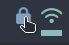
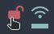

# Script: Polybar Awesome Mullvad

A simple script that displays the current status of mullvad (connected/disconnected) using font awesome icons.





## Dependencies

Requires font awesome for proper icons display: https://fontawesome.com/


## Configuration

Colors are set to nordified by default. Change the color code to the desired values for any other theme. By default, let clicking on the icon will launch the GUI.


## Module

```ini
[module/{ mullvad-status }]
type = custom/script
exec = ~/polybar-scripts/{ mullvad }.sh
interval = 5
click-left = mullvad-vpn
...
```
